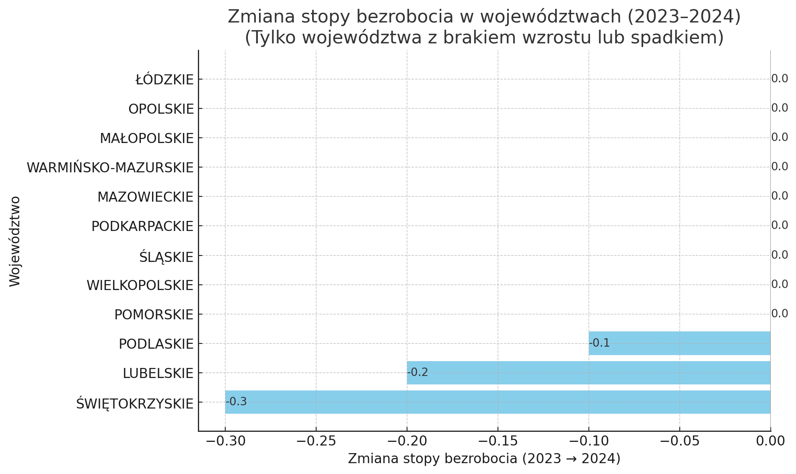
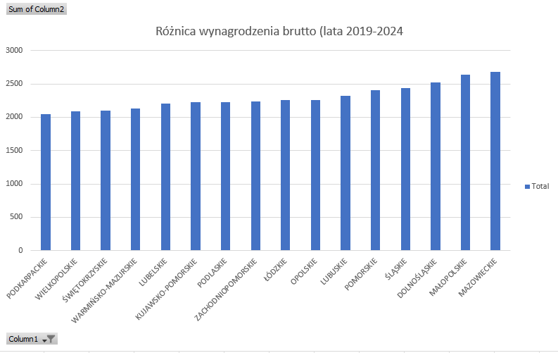

# Wstęp

Jako osoba poszukująca pracy stwierdziłem, że dobrym sposobem na pokazanie moich umiejętności analitycznych będzie zebranie i przetworzenie danych, które pozwolą mi zdeterminować, które miejsca w Polsce oferują najbardziej korzystne warunki zatrudnieniowe.

Celem tego projektu jest zawężenie obszaru poszukiwań do kilku województw i ewentualne pójście głębiej i zobaczenie, które powiaty bądź miasta mają największy potencjał. Po dane udałem się na [stronę GUSu](https://stat.gov.pl). Interesowały mnie takie zmiennie jak procent zarejestrowanego bezrobocia, liczba dostępnych miejsc pracy oraz pensje brutto.

### Narzędzia

Aby wydobyć potrzebne dane użyłem następujących narzędzi:

- SQL - jako podstawa do filtrowania i przetwarzania danych.
- PostgreSQL - mój wybór jeśli chodzi o system zarządzania bazami danych.
- Visual Studio Code - program, który wybrałem do pisania i egzekwowania zapytań.
- Git i GitHub - główny sposób udostępnienia i dzielenia się projektem.

# Analiza

Każde zapytanie miało za zadanie pokazać województwa, które w danej kategorii wypadają lepiej od pozostałych, aby potem łatwiej było dojść do wniosku, które ze wszystkich szesnastu dają największe szanse na znalezienie zatrudnienia oraz oferują adekwatne wynagrodzenia. 

### Zapytanie 1 - Malejąca stopa bezrobocia

Pierwsze zapytanie miało za zadanie pokazać mi, w których województwach stopa bezrobacia zmalała bądź została na tym samym poziomie między rokiem 2023 a 2024.

```sql
WITH bezrobocie_roznica AS 

 --CTE, które oblicza różnicę stopy bezrobocia między 2023 and 2024 rokiem

(
SELECT 
    nazwa,
    rok,
    wartosc,
    wartosc - LAG(wartosc, 1) 
        OVER (PARTITION BY nazwa
            ORDER BY rok) AS zmiana_stopy_bezrobocia

FROM bezrobocie_rejestrowane

--Klauzula WHERE, która pozwoli mi wyświetlić dane jedynie dla wojedwództw

WHERE rok IN(2023, 2024) AND
nazwa NOT LIKE 'Powiat%' AND 
nazwa NOT LIKE 'POLSKA'
ORDER BY zmiana_stopy_bezrobocia ASC
)

--Zapytanie, które filtruje tylko te województwa, gdzie stopa bezrobocia nie wzrosła w ostatnim roku

SELECT *
FROM bezrobocie_roznica
WHERE zmiana_stopy_bezrobocia <= 0
```



*Rezultat wygenerowany za pomocą ChatGPT.*

### Co się okazało:

- Jedyne województwa, które z roku 2023 na 2024 zmniejszyły stopę rejestrowanego bezrobocia to Swiętokrzyskie, Lubelskie i Podlaskie.

- 12 z 16 województw nie powiększyło swojej stopy bezrobocia.

- Jedynymi województwami z przyrostem stopy bezrobocia były Zachodniopomorskie, Kujawsko-Pomorskie, Lubuskie i Dolnośląskie


### Zapytanie 2 - Wolne miejsca pracy

Proste zapytanie, które pokazuje mi 5 województw, w których znajduje się najwięcej wolnych miejsc pracy. Najbardziej aktualne dane były dostępne na rok 2023. 

```sql
--Zapytanie mające za zadanie pokazanie top 5 województw pod względem ilości dostępnych miejsc pracy

Select *
FROM wolne_miejsca_pracy
WHERE rok = 2023 AND
jednostka_miary = 'tysiąc' AND
zakres_przedmiotowy NOT LIKE 'POLSKA'
ORDER BY wartosc DESC
LIMIT 5
```


### Zapytanie 3 - Zmiana średniego wynagrodzenia brutto

Zdecydowałem się sprawdzić o ile w każdym województwie wzorsła średnia pensja brutto i posortować wynik od największej do najmniejszej zmiany.

```sql
WITH porownanie AS (

--CTE, które oblicza zmianę wynagrodzenia brutto na przestrzeni ostatnich 5 lat

    SELECT
    nazwa,
    rok,
    (wartosc - LAG(wartosc, 1) 
        OVER (PARTITION BY nazwa
            ORDER BY rok)) AS zmiana
FROM wynagrodzenie_brutto
WHERE
rok BETWEEN 2019 and 2024 AND
nazwa NOT LIKE 'Powiat%' AND 
nazwa NOT LIKE 'POLSKA')
SELECT
    nazwa,
    SUM(zmiana) AS suma_zmiany_brutto
FROM porownanie
GROUP BY nazwa
ORDER BY suma_zmiany_brutto DESC
```



### Co się okazało:
- Różnica między pierwszym a ostatnim województwem wynosi ponad 600zł.
- Top 4 województwa pod względem wzrostu zarobków pojawiło się też w top 5 województw z największą ilością miejsc pracy

# Czego się nauczyłem
- Zaawansowane zapytania - Przekonałem się jak pomocnym elementem są CTE. Sprawiają, że bardziej skomplikowane zapytania stają się czytelniejsze, oraz pomagają rozwiązać problem krok po kroku zamiast próbować uzyskać końcowy rezultat jednym zapytaniem bez użycia CTE bądź subqueries.
- Szukania źródeł informacji - baza danych nie była dla mnie gotowa, co zmusiło mnie do założenia własnego jej hostingu oraz złożenia całości z kilku osobnych plików pobranych ze strony GUSu
- Rozwiązaywania problemów - zadanie sobie odpowiednich pytań, które pomogą w rozwiązaniu problemu, który przed sobą postawiłem, a następnie przekształcenie ich w zapytania czytelne dla języka SQL.
- Korzystania z dobrodzejstw sztucznej inteligencji - Przekonałem się do czego zdolny jest ChatGPT i jak mogę go wykorzystać do przyśpieszenia procesu analizy danych bez kompromisu jakościowego 

# Wnioski

1. Mazowieckie, Małopolskie i Śląskie województwa okazały się mieć dobre wyniki poprzez wszystkie 3 zapytania, co czyni je najlepszymi miejscami do poszukiwania zatrudnienia biorąc pod uwagę uwzględnione przeze mnie kryteria.
2. Województwo Wielkopolskie wypadło bardzo źle na tle reszty pod względem wzrostu płacy, mimo dobrej pozycji w pozostałych dwóch zestawieniach.